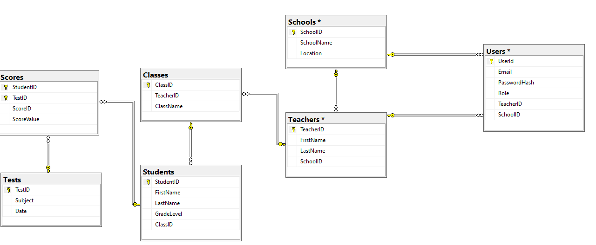
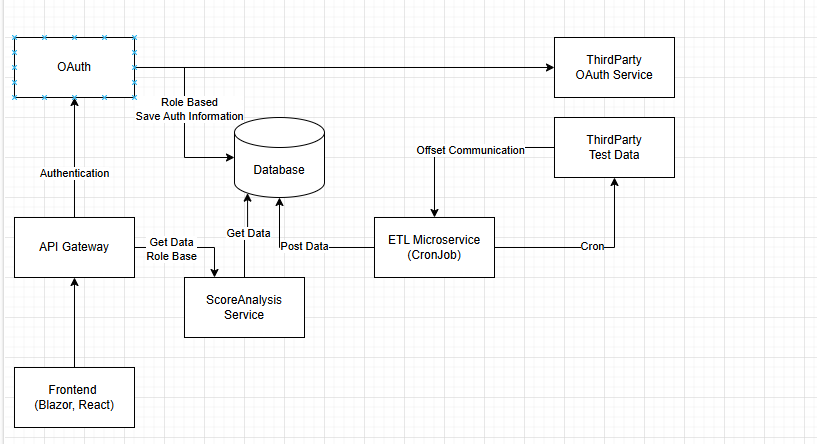

### Performance Task #1: Solution Design

#### Data Design- **Entities and Attributes:**
  - **Student:**
    - `StudentID` (Primary Key)
    - `FirstName`
    - `LastName`
    - `GradeLevel`
    - `ClassID` (Foreign Key)
  - **Test:**
    - `TestID` (Primary Key)
    - `Subject`
    - `Date`
  - **Score:**
    - `StudentID` (Foreign Key)
    - `TestID` (Foreign Key)
    - `ScoreValue`
  - **Class:**
    - `ClassID` (Primary Key)
    - `TeacherID` (Foreign Key)
    - `ClassName`
  - **Teacher:**
    - `TeacherID` (Primary Key)
    - `FirstName`
    - `LastName`
    - `SchoolID` (Foreign Key)
  - **School:**
    - `SchoolID` (Primary Key)
    - `SchoolName`
    - `Location`
  - **User:**
    - `UserID` (Primary Key)
    - `Email`
    - `PasswordHash`
    - `Role` (Teacher, SchoolLeader, FoundationStaff)
    - `TeacherID` (Foreign Key)
    - `SchoolID` (Foreign Key)
  - **Relationships:**
    - A `Student` belongs to a `Class`.
    - A `Class` is taught by a `Teacher`.
    - A `User` is belongs to a `Teacher` or `School`.
    - A `Teacher` works at a `School`.
    - A `Student` takes multiple `Tests`.
    - Each `Test` has multiple `Scores`.

#### Application Architecture
  

- **Presentation Layer:** (Not implemented yet)

  - Web Application Interface
    - Technologies: ASP.NET Core MVC or Blazor for frontend
    - Components: Dashboard, Report Viewer, User Authentication
    
- **Business Logic Layer:** (MVP implemented)
  - Backend Application
    - Technologies: ASP.NET Core Web API
    - Components: Score Calculation, Data Aggregation, User Roles Management

- **Data Access Layer:** (MVP implemented)
  - Database
    - Technologies: Entity Framework Core with SQL Server
    - Components: DbContext for database interaction
    
 #### Integration
 
- **API Integration:**
  - Use `ETL microservice` to retrieve test score data from a third-party system.
  - This is cron job service.
  - Secure API calls using API keys.
  
#### Source Code Control
    
- **Version Control:**
  - Use Git for source code control.
  - Host the repository on GitHub, GitLab, or Bitbucket.
  - Implement a branching strategy (e.g., Git Flow) for feature development and bug fixes.
  
### Performance Task #2: High-Level Tasks and Email to Project Manager
  
  **Email to Project Manager:**
  
  Subject: High-Level Task List and Time Estimates for Student Performance SystemHi [Project Manager's Name],I hope this message finds you well. Below is the proposed list of high-level tasks, dependencies, and time estimates for the development of the student performance system:

1. **Requirements Gathering and Analysis** (1 week)
   - Please provide specific details about your involvement with the Third Party.
   - Dependency: Input from stakeholders
2. **Data Model Design** (1 week)
   - Dependency: Completion of requirements analysis
3. **API Integration Design** (1 week)
   - Dependency: Access to third-party API documentation
4. **Frontend Development** (3 weeks)
   - Dependency: Finalized UI/UX design
5. **Backend Development** (3 weeks)
   - Dependency: Completion of data model design
6. **Testing and QA** (2 weeks)
   - Dependency: Completion of development tasks
7. **Deployment and Monitoring Setup** (1 week)
   - Dependency: Successful testing
8. **Assumptions:**
- Access to all necessary third-party API documentation is available.
- Stakeholders are available for timely feedback.

**Potential Risks/Concerns:**
- Delays in receiving API documentation might impact integration timelines.
- Changes in requirements after the initial analysis phase could extend development time.
- Potential data privacy and security concerns when handling student data.

Please let me know if you need any further details or adjustments to the timeline. I'm happy to discuss this further in our next project meeting.

Best regards,

[Name]

### Performance Task #3: Email to Maria

**Email to Maria:**

Subject: Request for Additional Information on Student Performance System Project

Hi Maria,

I hope you're doing well. As we begin to design the system for capturing and analyzing student performance on standardized tests, I wanted to reach out to gather some additional information that will help us develop a more detailed and effective solution.

Could you please provide insights on the following:

1. **Data Granularity:** Are there specific data points or metrics beyond the average scores that you are interested in capturing or analyzing? For example, are there any demographic factors or other performance indicators that should be considered?

2. **User Access and Permissions:** Could you clarify any specific access restrictions or permissions that should be enforced for different user roles (teachers, school leaders, KIPP Foundation staff)?

3. **Reporting Requirements:** Are there any specific reporting formats or visualization preferences that you have in mind? Understanding this will help us tailor the reports to meet your expectations.

4. **Integration with Existing Systems:** Are there any existing systems or databases that this new system needs to integrate with, aside from the third-party test score provider?

5. **Security and Compliance:** Are there any specific security or compliance requirements we need to adhere to, especially concerning student data privacy?

Your input on these questions will be invaluable in guiding our design process. Please let me know a convenient time for us to discuss this further, or feel free to reply with any information you have.

Thank you for your support and collaboration.

Best regards,

### Conceptual Diagram Description

Since I can't create visual diagrams directly here, I'll describe what the conceptual diagram should include:

1. **Entities and Relationships:**
   - Visual representation of the data model, showing entities like Student, Teacher, Class, School, Test, and Score.
   - Lines connecting these entities to illustrate relationships (e.g., Student to Class, Class to Teacher).

2. **Architecture Layers:**
   - **Frontend Layer:** Includes components like Dashboard, Report Viewer, and Authentication.
   - **Backend Layer:** Shows services like Score Calculation, Data Aggregation, and API Controllers.
   - **Data Layer:** Illustrates the database and DbContext.

3. **Integration Points:**
   - Highlight the connection to the third-party API for retrieving test scores.
   - Indicate security measures like OAuth or API keys for secure data transfer.

4. **User Roles and Access:**
   - Include icons or labels to represent different user roles and their access levels (Teacher, School Leader, KIPP Foundation Staff).
